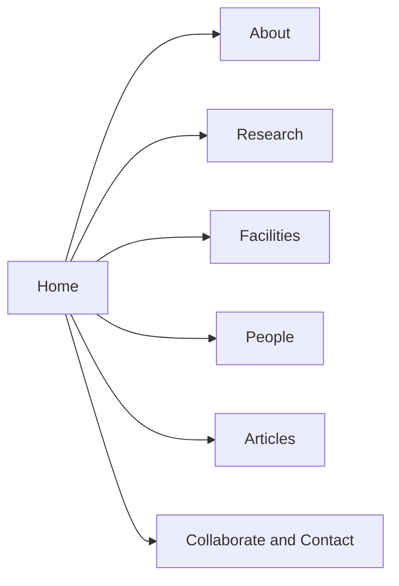
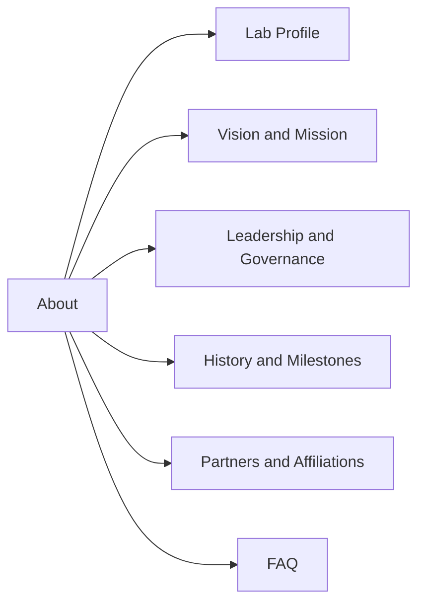
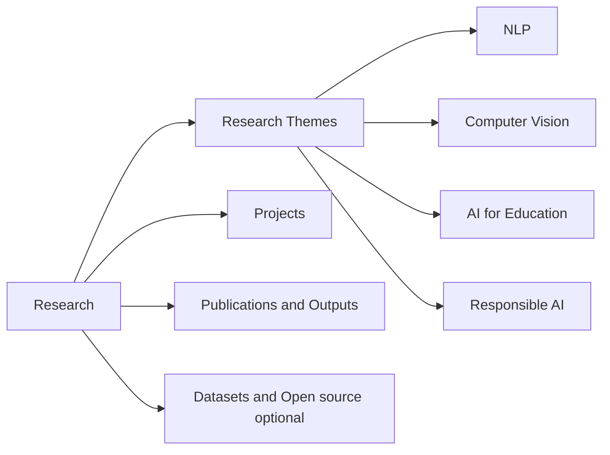
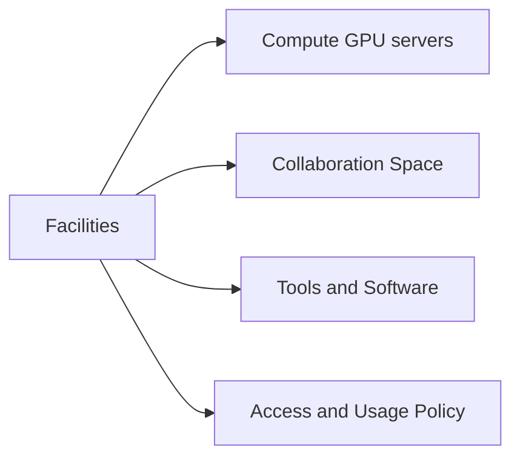
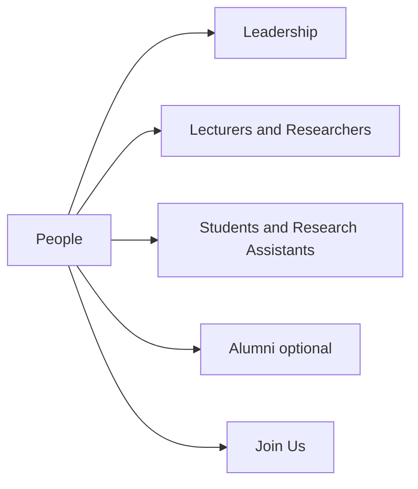
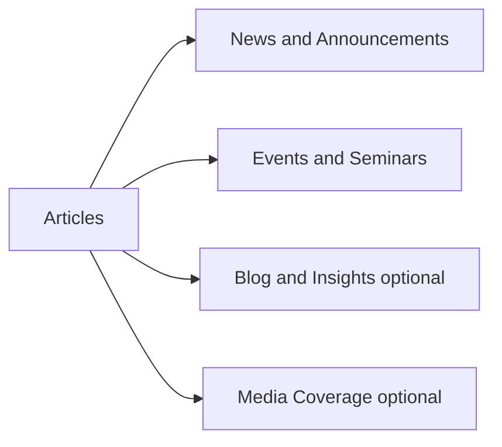
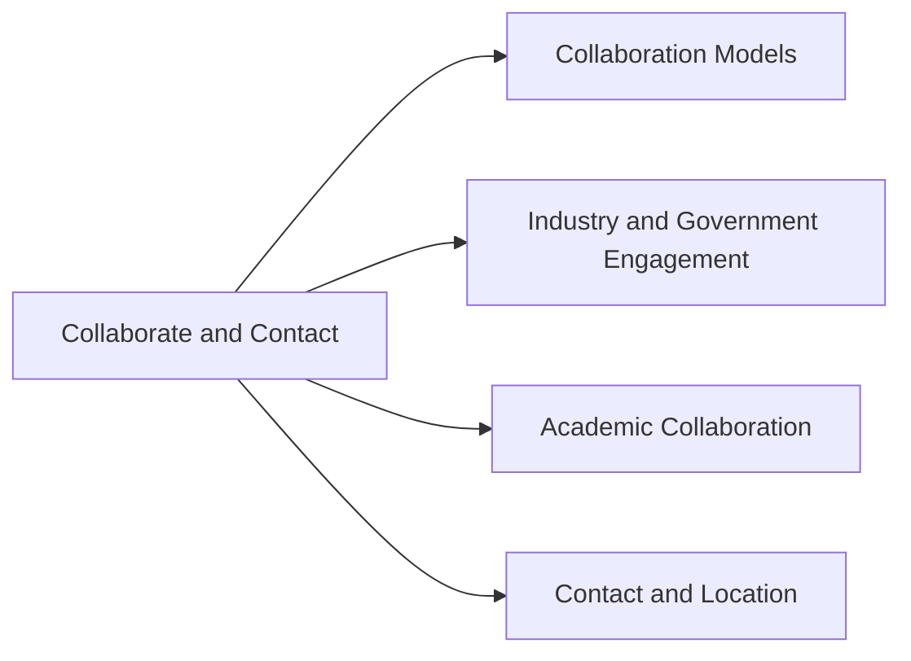

# InnoLab Microsite Concept (Draft)
BINUS University (Indonesia) — University-wide AI Research Laboratory

Status: Draft v0.1
Owner: InnoLab Web/Comms (to be assigned)
Last updated: 2026-01-07

---

## 1) Purpose and positioning
### 1.1 Why this microsite exists
- Provide a clear, credible public profile of InnoLab as BINUS University’s university-wide AI research laboratory.
- Showcase research themes, facilities, outputs, and people in a way that supports:
  - student recruitment (thesis, internships, research assistantships)
  - academic collaboration (joint research, visiting scholars)
  - industry/government partnerships (applied research, pilots, consulting)
  - internal university visibility (cross-faculty initiatives)

### 1.2 Primary audiences
- Prospective students (undergrad/grad) and current students
- BINUS lecturers/researchers across faculties
- External academics and research institutions
- Industry partners and government agencies
- Media and general public

### 1.3 Key messages (draft)
- InnoLab advances impactful AI research and responsible innovation for society.
- We combine strong academic foundations with applied, collaborative projects.
- We provide modern AI facilities (GPU compute + collaboration space) to accelerate research and learning.
- We publish, build, and share: papers, prototypes, datasets, and community activities.

### 1.4 Success criteria (what “good” looks like)
- Visitors can understand “what InnoLab is” within 10 seconds on the homepage.
- Clear pathways to: research themes, facilities, people, and how to collaborate.
- Articles/news are easy to browse and share; research outputs are discoverable.
- Lecturer list and contact points are accurate and maintained.

---

## 2) Information architecture (IA)
### 2.1 Top navigation (recommended)
1. Home
2. About
3. Research
4. Facilities
5. People
6. Articles
7. Collaborate / Contact

Notes:
- Keep top nav to 6–7 items for clarity.
- “Collaborate” can include partnership info + contact form.

### 2.2 Sitemap (v0.1)
- Home
- About
  - Lab Profile (Overview)
  - Vision & Mission
  - Leadership & Governance
  - History & Milestones
  - Partners & Affiliations
  - FAQ
- Research
  - Research Themes (NLP, Computer Vision, AI for Education, Responsible AI)
  - Projects (active + past)
  - Publications & Outputs
  - Datasets / Open-source (optional)
- Facilities
  - Compute (GPU servers)
  - Collaboration Space
  - Tools & Software
  - Access & Usage Policy
- People
  - Leadership
  - Lecturers / Researchers
  - Students & Research Assistants
  - Alumni (optional)
  - Join Us (positions, RA openings)
- Articles
  - News & Announcements
  - Events & Seminars
  - Blog / Insights (optional)
  - Media Coverage (optional)
- Collaborate / Contact
  - Collaboration Models
  - Industry & Government Engagement
  - Academic Collaboration
  - Contact & Location

### 2.3 Sitemap diagram (Mermaid)
The full sitemap is large; to keep it readable, it is split into a high-level map plus per-section diagrams.

#### 2.3.1 High-level sitemap

#### 2.3.2 About section

#### 2.3.3 Research section

#### 2.3.4 Facilities section

#### 2.3.5 People section

#### 2.3.6 Articles section

#### 2.3.7 Collaborate and Contact section

### 2.4 Footer navigation (recommended)
- Quick links: About, Research, Facilities, People, Articles, Contact
- Policies: Privacy, Terms, Accessibility statement
- Social: LinkedIn, YouTube, GitHub (as applicable)
- Address + map link
- Copyright

---

## 3) Layout guidance (how pages should be laid out)
This section describes recommended layout patterns (wireframe-level) to keep pages consistent and easy to scan.

### 3.1 Global layout rules
- Use a consistent page grid (e.g., 12-column) with a max content width and generous whitespace.
- Keep primary CTAs above the fold on landing pages.
- Prefer scannable sections: short paragraphs, bullets, cards, and clear headings.
- Use consistent “card” components for themes, projects, people, and articles.
- Provide a right-rail only when it adds value (e.g., on article detail pages for related posts).

### 3.2 Header layout
- Left: BINUS + InnoLab logo lockup
- Center/right: top navigation
- Right: primary CTA button (Collaborate) and optional search icon

### 3.3 Home page layout (recommended)
1. Hero band
   - H1 positioning statement
   - 1–2 CTAs
   - Optional: background image of lab activity
2. Highlights band (3–6 cards)
3. Research themes grid (4 cards)
4. Featured project(s) (2 cards) or carousel
5. Latest articles (3–5 list/cards)
6. People spotlight (leadership or featured lecturers)
7. Partners strip (logos) optional
8. Contact teaser (email + location + link)

### 3.4 Landing page layout (About, Research, Facilities, People, Articles)
1. Page header
   - H1 + 1–2 sentence intro
   - Optional: key stats (e.g., projects, publications)
2. Primary content blocks (cards or sections)
3. Secondary content blocks (optional)
4. CTA band (Join, Collaborate, Request access)
5. Related links (optional)

### 3.5 Detail page layout (Theme, Project, Person, Article)
- Top: title + metadata (tags, date, role)
- Main column:
  - Overview/summary
  - Body sections
  - Outputs/links
- Side column (optional):
  - Related items (projects, articles, people)
  - Contact card (for person/project)
- Bottom:
  - Next/previous or related content grid

### 3.6 People directory layout
- Filters at top: expertise tags, faculty, role
- Grid of person cards:
  - photo, name, title, tags, quick links
- Clicking a card opens person profile detail

### 3.7 Articles layout
- Listing:
  - featured article at top (optional)
  - filters + search
  - list/cards with date, category, tags
- Detail:
  - hero image optional
  - author and date
  - related articles at bottom

---

## 4) Page templates and content blocks
This section defines reusable page structures to keep the microsite consistent.

### 3.1 Global components (all pages)
- Header: logo + lab name + top navigation
- Search (optional for v0.1; recommended if many articles/people)
- Breadcrumbs (optional)
- Footer: quick links + contact + policies
- Consistent CTA style (e.g., “Collaborate with us”, “Join as RA”, “Explore research themes”)

### 3.2 Home page template
Required blocks:
1. Hero
   - One-sentence positioning
   - 1–2 CTAs (Explore Research, Contact/Collaborate)
2. Highlights (3–6 cards)
   - Research themes, facilities, latest article, featured project
3. Featured research themes (grid)
4. Latest articles/news (3–5)
5. People spotlight (leadership or featured lecturers)
6. Partners strip (logos) (optional)
7. Contact teaser (email + location)

### 3.3 About page template (Lab Profile)
Required blocks:
- Overview (what we do)
- Vision & mission
- What makes InnoLab different (3–5 bullets)
- Governance (director, steering committee)
- Milestones timeline (optional)
- CTA: collaborate / join / contact

### 3.4 Research landing template
Required blocks:
- Intro + research philosophy
- Research themes (cards)
- Featured projects (2–4)
- Publications/outputs preview
- CTA: propose collaboration / student opportunities

### 3.5 Research theme detail template
Required blocks:
- Theme overview
- Key problems we work on
- Methods/approaches
- Example projects
- Outputs (papers, demos)
- People involved
- CTA: collaborate / student projects

### 3.6 Facilities landing template
Required blocks:
- Facilities overview
- Compute (GPU servers) details
- Collaboration space details
- Access policy summary + link to full policy
- Request access CTA

### 3.7 People landing template
Required blocks:
- Leadership cards
- Lecturer list (filterable by expertise)
- Students/RA list (optional)
- Join us CTA

### 3.8 Person profile template (lecturer/researcher)
Required blocks:
- Name, title, affiliation
- Short bio
- Expertise tags (NLP, CV, AI Ed, Responsible AI, etc.)
- Selected publications/projects
- Contact links (email, Google Scholar, ORCID, LinkedIn)
- Office hours / availability (optional)

### 3.9 Articles listing + article detail template
Listing:
- Filters: category (News, Events, Blog), year, tags
- Search (optional)
- Pagination
Detail:
- Title, date, author
- Summary/lead
- Body content
- Related articles
- Share links

### 3.10 Collaborate / Contact template
Required blocks:
- Collaboration models (academic, industry, government)
- Engagement process (how to start)
- What we can offer (research, pilots, training)
- Contact form + email + location
- FAQ (optional)

---

## 4) Draft content (placeholder copy)
This is draft copy to populate the microsite. Replace names, numbers, and specifics later.

## 4.1 Home (draft copy)
### Hero
**InnoLab — BINUS University AI Research Laboratory**  
Advancing AI research and responsible innovation across the university, from foundational methods to real-world impact.

CTAs:
- Explore Research
- Collaborate with InnoLab

### Highlights (example cards)
- Research Themes: NLP, Computer Vision, AI for Education, Responsible AI
- Facilities: GPU compute + collaboration space
- Featured Project: AI-assisted learning analytics (pilot)
- Latest Article: Seminar recap / new publication announcement

### Short “About” snippet
InnoLab is a university-wide AI research laboratory at BINUS University. We bring together lecturers, students, and partners to develop AI methods and applications that are rigorous, ethical, and impactful.

---

## 4.2 About → Lab Profile (draft copy)
### Overview
InnoLab is BINUS University’s university-wide AI research laboratory. We conduct research, build prototypes, and publish outputs across key AI domains, while supporting education and cross-faculty collaboration.

### Vision
To be a leading university AI lab in Indonesia that advances trustworthy AI research and delivers measurable societal impact.

### Mission
- Conduct high-quality AI research and publish in reputable venues.
- Build applied AI solutions through interdisciplinary collaboration.
- Provide facilities and mentorship for student research and innovation.
- Promote responsible AI practices, transparency, and reproducibility.

### What we do (bullets)
- Research: methods and applications in NLP, computer vision, and AI for education
- Prototyping: proof-of-concepts, demos, and pilots with partners
- Capacity building: seminars, workshops, student mentorship
- Responsible AI: fairness, privacy, safety, and governance

### Leadership & governance (placeholders)
- Lab Director: [Name], [Title], BINUS University
- Deputy Director: [Name], [Title]
- Steering Committee: representatives from multiple faculties
- Advisory Board (optional): external academics/industry experts

### History & milestones (placeholders)
- 20XX: InnoLab established as a university-wide AI research initiative
- 20XX: First GPU compute cluster deployed
- 20XX: First cross-faculty AI for Education pilot launched
- 20XX: First international collaboration / grant awarded

### Partners & affiliations (placeholders)
- Internal: faculties, research centers, innovation office
- External: universities, industry partners, government agencies

### FAQ (starter questions)
- How can students join InnoLab projects?
- Do you accept industry-sponsored research?
- Can external researchers access facilities?
- Where are you located?

---

## 4.3 Research (draft copy)
### Research philosophy
We pursue research that is:
- rigorous (sound methodology and evaluation)
- reproducible (clear documentation and artifacts when possible)
- responsible (ethical, fair, privacy-aware)
- impactful (aligned with education and societal needs)

### Research themes (draft)
#### Natural Language Processing (NLP)
Focus areas:
- Indonesian language understanding and generation
- information extraction and document intelligence
- conversational AI and retrieval-augmented generation (RAG)
Example outputs:
- domain-specific chat assistants
- text classification and summarization benchmarks

#### Computer Vision
Focus areas:
- visual recognition and detection
- document and scene understanding
- multimodal learning (vision + language)
Example outputs:
- assistive vision systems
- automated document processing pipelines

#### AI for Education
Focus areas:
- learning analytics and student success prediction
- intelligent tutoring and feedback systems
- assessment support and academic integrity tools (responsible use)
Example outputs:
- early warning dashboards (privacy-aware)
- AI-assisted learning content tools

#### Responsible AI
Focus areas:
- fairness and bias evaluation
- privacy-preserving ML
- model safety, transparency, and governance
Example outputs:
- responsible AI checklists and evaluation protocols
- model cards and documentation templates

### Projects (structure)
For each project:
- Title
- Status (Active / Completed)
- Theme(s)
- Summary (2–3 sentences)
- Team (lecturers + students)
- Partner (if any)
- Outputs (paper/demo/code)

Example project placeholders:
- “Indonesian Academic Document Intelligence”
- “Multimodal AI for Classroom Engagement Analysis”
- “Responsible AI Evaluation Toolkit for University Use”

### Publications & outputs (structure)
- Publications (by year)
- Prototypes/demos
- Datasets (if shareable)
- Open-source repositories (GitHub)

---

## 4.4 Facilities (draft copy)
### Facilities overview
InnoLab provides shared AI research facilities to support experimentation, training, and collaboration.

### Compute: GPU servers
Capabilities (placeholders):
- GPU compute for training and inference workloads
- shared storage for datasets and experiments
- job scheduling / access control (if applicable)
Usage principles:
- fair access for research and teaching support
- priority for approved lab projects
- responsible data handling and privacy compliance

### Collaboration space
- meeting and discussion area for project teams
- seminar/workshop setup (hybrid-ready if possible)
- whiteboards and prototyping tools (as available)

### Tools & software (examples)
- ML frameworks: PyTorch, TensorFlow
- Experiment tracking: MLflow / Weights & Biases (as decided)
- Collaboration: GitHub, shared documentation
- Data labeling tools (optional)

### Access & usage policy (summary)
- Access requires a request and approval (project-based)
- Users must follow data privacy and security guidelines
- Publication and IP rules follow BINUS University policy and partner agreements

CTA:
- Request facility access

---

## 4.5 People (draft copy)
### People overview
InnoLab is a cross-faculty community of lecturers, researchers, and students working on AI research and applications.

### Leadership (placeholders)
- Director: [Name] — [Expertise]
- Deputy Director: [Name] — [Expertise]
- Operations/Program Manager (optional): [Name]

### Lecturers / Researchers (structure)
For each lecturer:
- Name, title, faculty/department
- Expertise tags (NLP, CV, AI Ed, Responsible AI)
- Short bio (2–3 lines)
- Links: email, Google Scholar, ORCID, personal page

Suggested grouping:
- By theme (NLP / CV / AI Ed / Responsible AI)
- Or by faculty, with filters for expertise

### Students & Research Assistants (optional for v0.1)
- Current RAs (name + project)
- Thesis students (name + topic)
- Alumni (optional)

### Join us (draft)
We welcome motivated students and collaborators. Opportunities may include:
- research assistantships
- thesis supervision and co-supervision
- internships and capstone projects
- visiting researcher collaboration

CTA:
- View open opportunities
- Contact InnoLab

---

## 4.6 Articles (draft copy)
### Categories
- News & Announcements: publications, awards, lab updates
- Events & Seminars: talks, workshops, reading groups
- Blog / Insights (optional): explainers, project stories, responsible AI notes

### Editorial guidelines (starter)
- Keep posts concise and scannable
- Include a short summary and 1–2 images when possible
- Add tags (theme, project, partner)
- Link to related research outputs

---

## 4.7 Collaborate / Contact (draft copy)
### Collaboration models
Academic:
- joint research proposals and publications
- visiting scholar / student exchange
- shared datasets and benchmarks (where permitted)

Industry & government:
- applied research and pilots
- evaluation and benchmarking
- training/workshops (responsible AI, ML fundamentals, applied AI)

### Engagement process (simple)
1. Initial inquiry (email/form) with problem statement and goals
2. Scoping call (feasibility, data, timeline, ethics)
3. Proposal (deliverables, team, governance)
4. Execution (regular check-ins, documentation)
5. Outputs (report, prototype, publication where appropriate)

### Contact details (placeholders)
- Email: innolab@binus.ac.id (placeholder)
- Location: BINUS University, [Campus/Building], Indonesia
- Social: LinkedIn / YouTube / GitHub (as applicable)

---

## 5) Content governance (recommended)
### 5.1 Ownership
- About/People: maintained by Lab Admin + Director approval
- Research/Projects: maintained by theme leads / project owners
- Articles: maintained by Comms editor; authors are lecturers/students
- Facilities: maintained by Lab Ops/IT

### 5.2 Update cadence (minimum)
- People: monthly review
- Projects: quarterly review
- Facilities: when changes occur + quarterly check
- Articles: as events/publications happen (target: at least monthly)

### 5.3 Content quality checklist
- Names/titles correct
- Links work (Scholar/ORCID/GitHub)
- Images have alt text
- No sensitive data disclosed
- Clear CTA and contact point

---

## 6) SEO, accessibility, and compliance (baseline)
### SEO basics
- Each page has a unique title and meta description
- Use descriptive headings (H1 once per page)
- Clean URLs (e.g., /research/nlp)
- Structured data for articles and people (optional later)

### Accessibility basics
- Sufficient color contrast
- Keyboard navigable menus
- Alt text for images
- Captions/transcripts for videos (if used)

### Compliance notes
- Follow BINUS University privacy policy and data handling rules
- For AI demos: include responsible use disclaimers where needed

---

## 7) Open questions for next iteration
- Confirm official lab name styling: InnoLab vs InnoLab AI Research Laboratory
- Confirm official contact email, location, and social links
- Decide whether to include:
  - Publications database integration (e.g., Scholar feed)
  - Search feature
  - Dataset/open-source page
- Confirm content approval workflow and who can publish articles