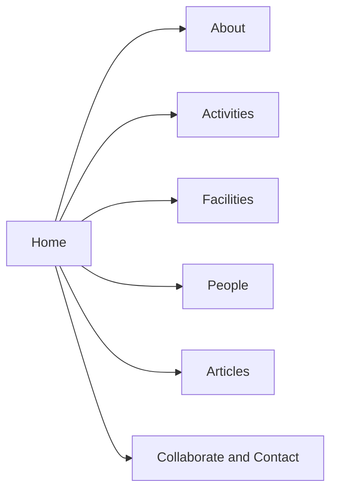
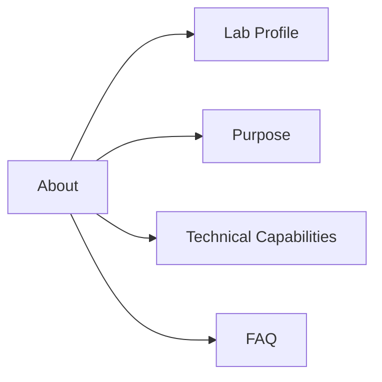
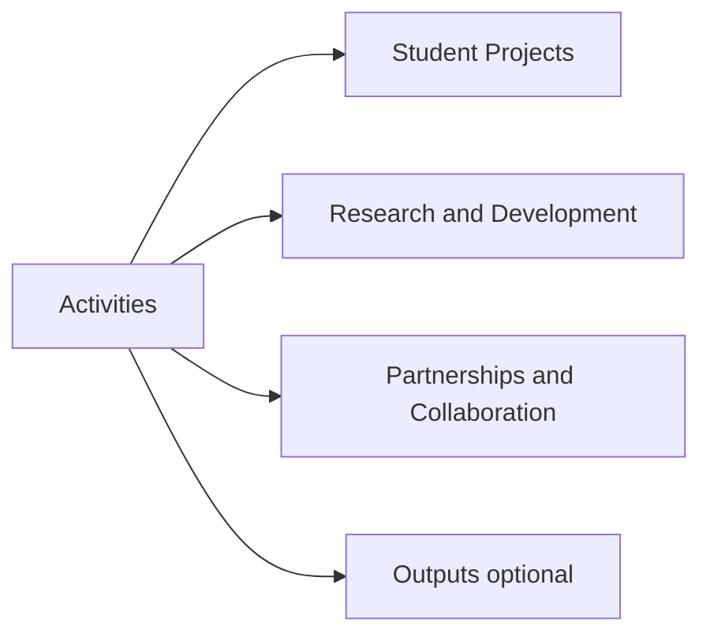
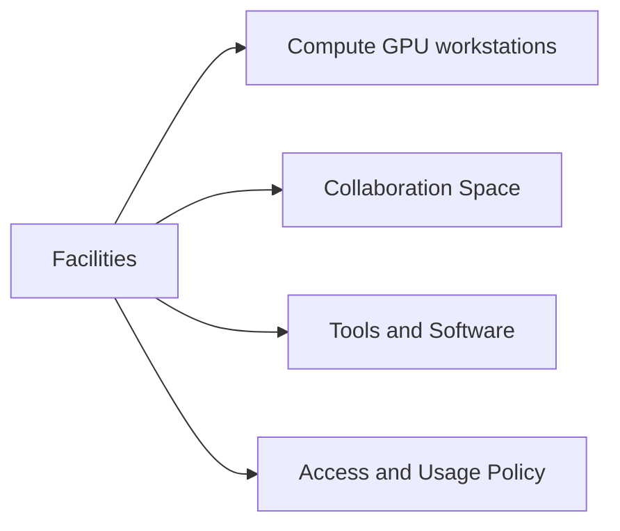
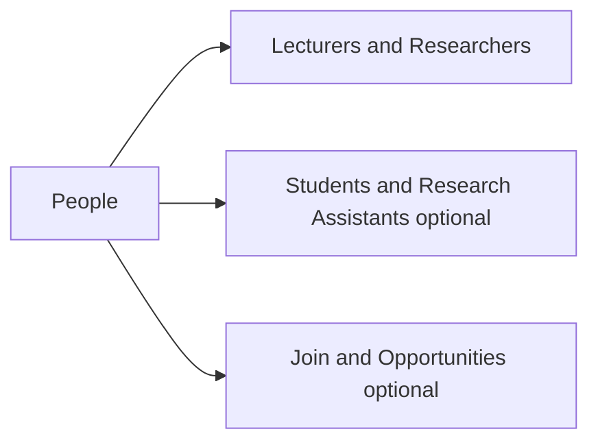
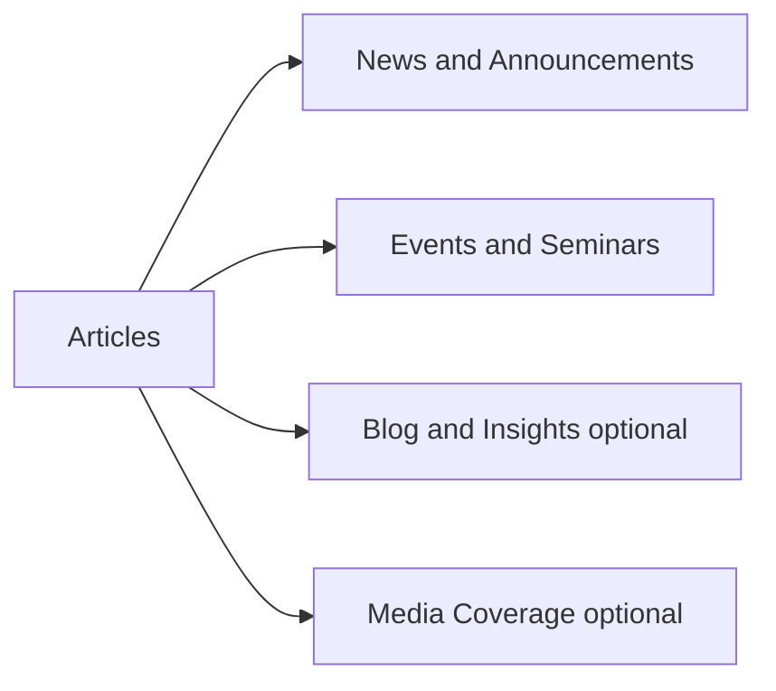
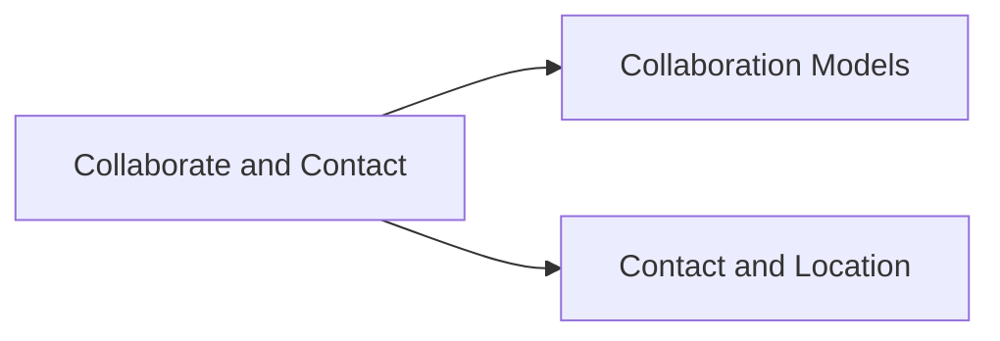

# INNOGEN Lab Microsite Concept (Draft)
BINUS University (Indonesia) — Academic and Research Facility at BINUS @Bekasi (School of Information Systems)

Status: Draft v0.2  
Owner: INNOGEN Lab Web/Comms (to be assigned)  
Last updated: 2026-01-08  

---

## 1) Purpose and positioning

### 1.1 Why this microsite exists
- Provide a clear, credible public profile of **INNOGEN Lab** (Innovation Intelligent Knowledge Generation) as a new academic and research facility at **BINUS @Bekasi**, supported by the **School of Information Systems**.
- Showcase the lab’s purpose, facilities, capabilities, and activities in a way that supports:
  - student engagement (coursework support, projects, thesis, research assistantships)
  - academic collaboration (joint research, cross-campus initiatives)
  - industry partnerships (applied analytics/AI projects, pilots, prototyping)
  - internal university visibility (cross-program collaboration and AI-driven learning ecosystem)

### 1.2 Primary audiences
- Prospective and current students (undergrad/grad)
- BINUS lecturers and researchers across programs
- Industry partners seeking applied analytics/AI projects
- External academics and research institutions (as collaboration partners)
- Media and general public

### 1.3 Key messages (draft)
- INNOGEN Lab is a multi-purpose space for **teaching, research, and collaboration** in AI and data-driven innovation.
- We enable hands-on learning and real-world prototyping in **AI, data science, smart systems, and Industry 4.0**.
- We provide modern facilities for experimentation: **GPU-capable workstations**, AI development environments, and collaboration space.
- We support outcomes: **prototypes**, **research experiments**, and **publications**, with opportunities for cross-program and external collaboration.

### 1.4 Success criteria (what “good” looks like)
- Visitors can understand “what INNOGEN Lab is” within 10 seconds on the homepage.
- Clear pathways to: purpose, facilities/capabilities, activities (projects/research), and how to collaborate.
- Content is scannable and credible (no over-claims; aligned to official description).
- Contact points and location (BINUS @Bekasi) are clear and maintained.

---

## 2) Information architecture (IA)

### 2.1 Top navigation (recommended)
1. Home
2. About
3. Activities
4. Facilities
5. People
6. Articles
7. Collaborate / Contact

Notes:
- Keep top nav to 6–7 items for clarity.
- “Collaborate” can include partnership info + contact form.

### 2.2 Sitemap (v0.2)
- Home
- About
  - Lab Profile (Overview)
  - Purpose (Teaching, Research, Collaboration)
  - Technical Capabilities
  - FAQ
- Activities
  - Student Projects
  - Research & Development
  - Partnerships & Collaboration
  - Outputs (Publications / Prototypes) (optional for v0.1)
- Facilities
  - Compute (GPU workstations)
  - Collaboration Space
  - Tools & Software
  - Access & Usage Policy
- People
  - Lecturers / Researchers
  - Students & Research Assistants (optional)
  - Join / Opportunities (optional)
- Articles
  - News & Announcements
  - Events & Seminars
  - Blog / Insights (optional)
  - Media Coverage (optional)
- Collaborate / Contact
  - Collaboration Models
  - Contact & Location

### 2.3 Sitemap diagram (Mermaid)
The full sitemap is large; to keep it readable, it is split into a high-level map plus per-section diagrams.

#### 2.3.1 High-level sitemap

#### 2.3.2 About section

#### 2.3.3 Activities section

#### 2.3.4 Facilities section

#### 2.3.5 People section

#### 2.3.6 Articles section

#### 2.3.7 Collaborate and Contact section

### 2.4 Footer navigation (recommended)
- Quick links: About, Activities, Facilities, People, Articles, Contact
- Policies: Privacy, Terms, Accessibility statement
- Social: LinkedIn, YouTube, GitHub (as applicable)
- Address + map link
- Copyright

---

## 3) Layout guidance (how pages should be laid out)
This section describes recommended layout patterns (wireframe-level) to keep pages consistent and easy to scan.

### 3.1 Global layout rules
- Use a consistent page grid (e.g., 12-column) with a max content width and generous whitespace.
- Keep primary CTAs above the fold on landing pages.
- Prefer scannable sections: short paragraphs, bullets, cards, and clear headings.
- Use consistent “card” components for activities, people, and articles.
- Provide a right-rail only when it adds value (e.g., on article detail pages for related posts).

### 3.2 Header layout
- Left: BINUS + INNOGEN Lab logo lockup
- Center/right: top navigation
- Right: primary CTA button (Collaborate) and optional search icon

### 3.3 Home page layout (recommended)
1. Hero band
   - H1 positioning statement
   - 1–2 CTAs
   - Optional: background image of lab activity
2. Highlights band (3–6 cards)
3. Core purpose (3 cards: Teaching, Research, Collaboration)
4. Facilities snapshot (compute + tools + collaboration space)
5. Latest articles (3–5 list/cards)
6. People spotlight (featured lecturers / supervisors)
7. Partners strip (logos) optional
8. Contact teaser (email + location + link)

### 3.4 Landing page layout (About, Activities, Facilities, People, Articles)
1. Page header
   - H1 + 1–2 sentence intro
   - Optional: key stats (e.g., projects, publications)
2. Primary content blocks (cards or sections)
3. Secondary content blocks (optional)
4. CTA band (Join, Collaborate, Request access)
5. Related links (optional)

### 3.5 Detail page layout (Activity, Person, Article)
- Top: title + metadata (tags, date, role)
- Main column:
  - Overview/summary
  - Body sections
  - Outputs/links
- Side column (optional):
  - Related items (activities, articles, people)
  - Contact card (for person/activity)
- Bottom:
  - Next/previous or related content grid

### 3.6 People directory layout
- Filters at top: expertise tags, program/affiliation, role
- Grid of person cards:
  - photo, name, title, tags, quick links
- Clicking a card opens person profile detail

### 3.7 Articles layout
- Listing:
  - featured article at top (optional)
  - filters + search
  - list/cards with date, category, tags
- Detail:
  - hero image optional
  - author and date
  - related articles at bottom

---

## 4) Page templates and content blocks
This section defines reusable page structures to keep the microsite consistent.

### 4.1 Global components (all pages)
- Header: logo + lab name + top navigation
- Search (optional for v0.1; recommended if many articles/people)
- Breadcrumbs (optional)
- Footer: quick links + contact + policies
- Consistent CTA style (e.g., “Collaborate with us”, “Request facility access”, “Explore facilities”)

### 4.2 Home page template
Required blocks:
1. Hero
   - One-sentence positioning
   - 1–2 CTAs (Explore Facilities, Collaborate/Contact)
2. Highlights (3–6 cards)
   - Core purpose, facilities, latest article, featured activity
3. Core purpose (3 cards)
4. Facilities snapshot
5. Latest articles/news (3–5)
6. People spotlight
7. Partners strip (optional)
8. Contact teaser (email + location)

### 4.3 About page template (Lab Profile)
Required blocks:
- Overview (what the lab is)
- Core purpose (Teaching, Research, Collaboration)
- Technical capabilities (summary)
- Who it is for
- Why it matters
- CTA: collaborate / contact

### 4.4 Activities landing template
Required blocks:
- Intro (what activities are covered)
- Student projects (cards/list)
- Research & development (cards/list)
- Partnerships & collaboration (cards/list)
- Optional outputs preview (publications/prototypes)
- CTA: propose collaboration / student opportunities

### 4.5 Facilities landing template
Required blocks:
- Facilities overview
- Compute (GPU workstations) details
- Collaboration space details
- Tools & software summary
- Access policy summary + link to full policy
- Request access CTA

### 4.6 People landing template
Required blocks:
- Featured lecturers/researchers
- Directory entry point (filters)
- Optional: students/RA preview
- Join/opportunities CTA (optional)

### 4.7 Person profile template (lecturer/researcher)
Required blocks:
- Name, title, affiliation
- Short bio
- Expertise tags
- Selected publications/projects (if available)
- Contact links (email, Google Scholar, ORCID, LinkedIn)

### 4.8 Articles listing + article detail template
Listing:
- Filters: category (News, Events, Blog), year, tags
- Search (optional)
- Pagination
Detail:
- Title, date, author
- Summary/lead
- Body content
- Related articles
- Share links

### 4.9 Collaborate / Contact template
Required blocks:
- Collaboration models (academic, industry)
- Engagement process (how to start)
- What we can offer (projects, pilots, mentoring)
- Contact form + email + location
- FAQ (optional)

---

## 5) Draft content (aligned to official information)

### 5.1 Home (draft copy)
#### Hero
**INNOGEN Lab — BINUS @Bekasi AI and Data Innovation Facility**  
A multi-purpose academic and research space supporting AI, data science, smart systems, and Industry 4.0 innovation.

CTAs:
- Explore Facilities
- Collaborate / Contact

#### Highlights (example cards)
- Core purpose: Teaching and Learning
- Core purpose: Research and Development
- Core purpose: Collaboration and Impact
- Facilities: GPU-capable workstations and collaboration space

#### Short “About” snippet
INNOGEN Lab (Innovation Intelligent Knowledge Generation) is a new academic and research facility at BINUS @Bekasi, supported by the School of Information Systems. The lab enables hands-on learning, research experimentation, and collaboration to build real-world AI and data-driven prototypes.

---

### 5.2 About → Lab Profile (draft copy)
#### Overview
INNOGEN Lab is a multi-purpose academic and research facility at BINUS @Bekasi. It supports teaching and learning, AI-driven research and development, and collaboration with internal and external partners.

#### Core purpose
- **Teaching & learning:** practical lab sessions and hands-on student projects in AI-related subjects
- **Research & development:** research in analytics, automation, and intelligent systems; publications and prototypes
- **Collaboration & impact:** joint projects with industry and institutions; cross-program collaboration

#### Technical capabilities (summary)
- GPU-capable workstations for deep learning
- AI development environments (Python, TensorFlow, PyTorch, Keras)
- Tools for data engineering, IoT simulation, and cloud computing
- Collaboration space for mentoring and supervision

#### Who it is for
- Students (undergraduate and graduate)
- Lecturers and researchers across BINUS
- Industry partners seeking applied analytics/AI projects

#### Why it matters
INNOGEN Lab strengthens BINUS’s mission to become an AI-driven campus by providing a dedicated environment to build prototypes, run research experiments, publish scientific papers, and develop industry-ready skills.

---

## 6) Content governance (recommended)

### 6.1 Ownership
- About/People: maintained by Lab Admin + Director approval
- Activities: maintained by activity owners (course coordinators, project leads)
- Articles: maintained by Comms editor; authors are lecturers/students
- Facilities: maintained by Lab Ops/IT

### 6.2 Update cadence (minimum)
- People: monthly review
- Activities: quarterly review
- Facilities: when changes occur + quarterly check
- Articles: as events/publications happen (target: at least monthly)

### 6.3 Content quality checklist
- Names/titles correct
- Links work (Scholar/ORCID/GitHub)
- Images have alt text
- No sensitive data disclosed
- Clear CTA and contact point

---

## 7) Open questions for next iteration
- Confirm official contact email, location details (building/room), and social links.
- Decide whether to include:
  - Outputs page (publications/prototypes) in v0.1
  - Search feature
  - Student/RA directory pages
- Confirm content approval workflow and who can publish articles.